# FlightSurety

FlightSurety is a flight insurance application project for Udacity's Blockchain nanodegree, build for the Ethereum platform. The application is made of the following components:
- the FlightSuretyData smart contract, designed to implement the data storage
- the FlightSuretyApp smart contract, designed to implement the business logic
- the 28 functional tests
- the server providing oracles support
- the distributed app (DApp) providing uer interface to the application

## Business process

The business process implemented by the application follows these steps:

1. On the deployment of the contracts, the App contract gets the address of the Data contract
2. On startup, the server will register a number of oracles, designed to provide on-demand flight status
3. Each airline that wants to be added to the applicatoin, must be invited by another airline already registered. An invited airline has yet to be funded and registered.
4. The first airline (First airline, address[1]), is automatically invited and registered during the construction of the Data contract.
5. After an airline is invited, it needs to be funded and registered to be fully operative.
6. The first four airlines (including the First Airline) are automatically registered when they pay the registration fee (fund themselves)
7. Starting with the 5th airline, after the airline funds itself (pay the registration fee), the other airlines must vote if to accept or not this applying airline( multi-party consensus ). The applying airline needs 50% or more of the other airlines, in order to be fully registered and operational. The applying airline gets registered on the vote event that makes the 50% threshold.
8. A registered airline can register new flights, as many it wants. On the registration of each new flight, the airline pays a flight registratoin fee.
9. Any number of travelers can purchase flight insurance for one or more (any) of the already registered flights.
10. An airline can change the status of its registered flights (on-time, late-airline, late-weather, late-technical, etc, etc)
11. If the status of an air flight is changed to LATE_AIRLINE, the travelers who purchasd insurance for that flight are reimbursed the cost of the flight insurance times an insurance credit multiplier
12. Travelers can cash-out the credit cumulated (if any) for LATE_AIRLINE flights
13. The application can trigger requests to oracles to provide flight status for a certain flight. The request is also filtered for a randomly generated index.
14. The oracles listen for this event, and only the oracles that match the index in the request (with one of their indexes) will reply back to the application, with the flight status.


## Local blockchain and Addresses allocation

The testing and validation of this application was done on a local blockchain and addresses generated by Ganache UI. Here are the local provider settings:
- mnemonic:     "candy maple cake sugar pudding cream honey rich smooth crumble sweet treat"
- host:port:    127.0.0.1:7545
- default balance: 100 ether
- number of accounts: 50
- gas limit:    9999999

address[0] - 0x627306090abaB3A6e1400e9345bC60c78a8BEf57 - the owner of the contracts
address[1] - 0xf17f52151EbEF6C7334FAD080c5704D77216b732 - the "First Airline" 
address[2]  ... address[10] - airlines
address[11] ... address[20] - travelers
address[21] ... address[40] - oracles


## Install

To install, download or clone the repo, change in the root directory of the application and run:

```
npm install
truffle compile --all
```

## Truffle functional tests

There are 28 functional tests in Truffle, testing the functionality and the features of both smart contracts.

To run Truffle tests:

`truffle test ./test/flightSurety.js`

The oracle tests have been moved to this test file, because of convenience (airlines and flights already registered in the previous tests. No need to run the /test/oracles.js.

Here is the output of the 28 test cases:

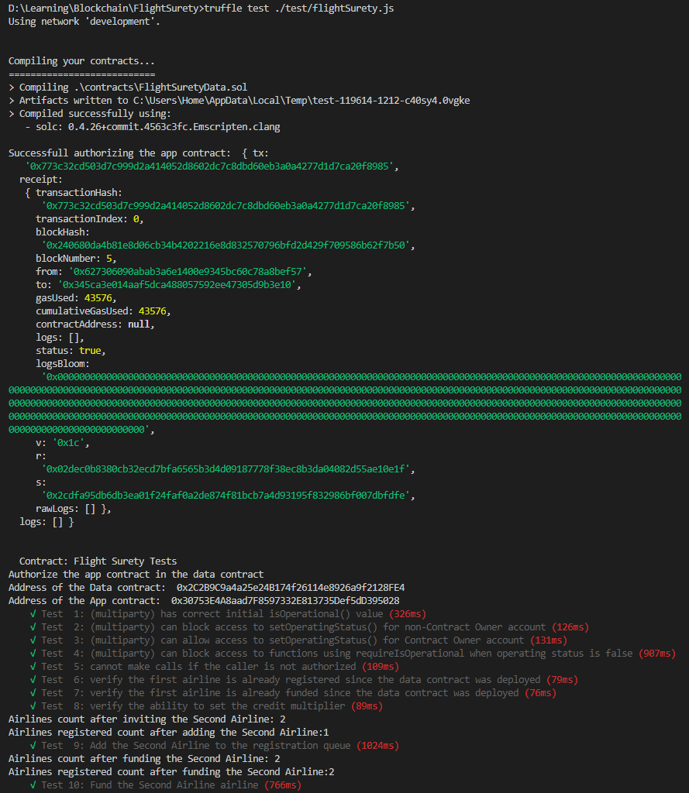
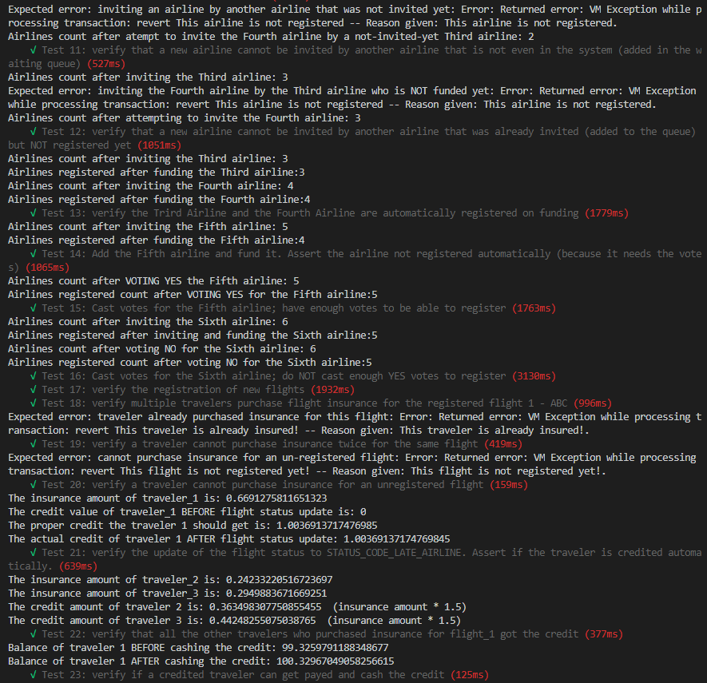
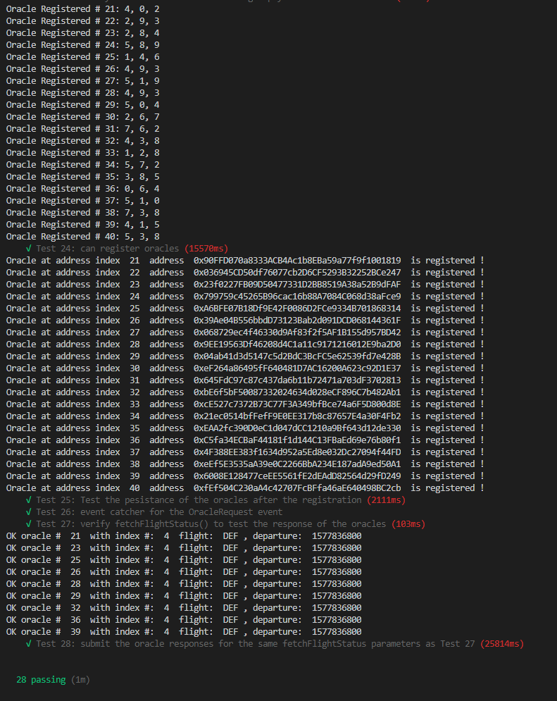

You can see that the output of some tests are expected errors, and these are normal expected errors when testing and asserting conditions that certain situations should not be allowed to happen.
Capturing these situatoins is the proof of successful tests.

## Migrate the contracts to the local provider

After running the tests, it's a good idea to restart Ganache UI, to reset all accounts and start from fresh. 
- Restart Ganache UI.
- Migrate contracts:
```
truffle migrate --reset
```
## Run the server

In a separate terminal, run the server:
```
npm run server
```
The server is configured to register 20 oracles, using the Ganache addresses index range from 21 to 40
Uppon starting the server, the output shows the successfull registration of each oracle, and the 3 indexes assigned:


The server also listens on port 3000. 
There is a REST endpoint to verify all the registeres oracles and their assigned indexes:
```
http://localhost:3000/oracles
```
generating this output:
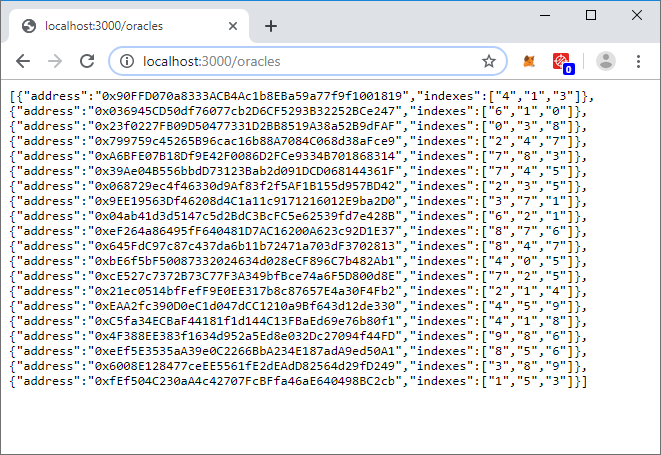


## Run the DApp

In a separate terminal, run the DApp:

```
npm run dapp
```
To view the Dapp, open a browser, also open the console of the browser:
```
http://localhost:8000
```
The browser will load the Dapp UI:
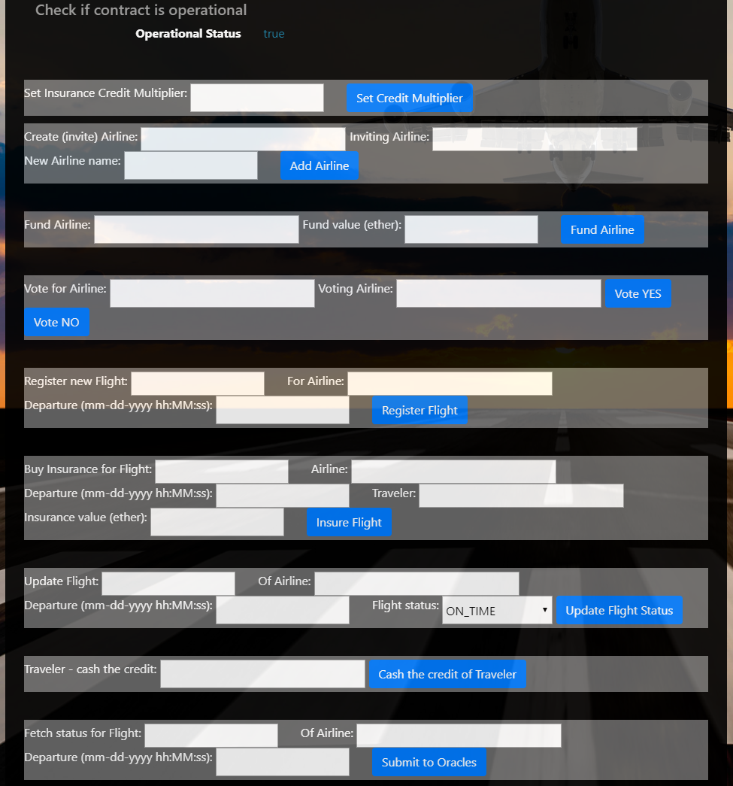

On startup of the Dapp, the status of the applicatin is "Operational"


## Proofing the application

Here are several actions to proof the functionality of the application

### Set the credit multiplier
In the DApp UI, enter the value "3" for the credit multiplier, and click the button "Set Credit Multiplier"

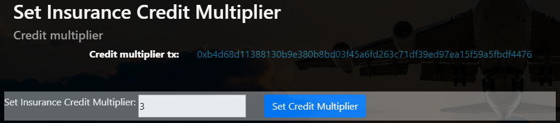

See in the console of the browser, the message: "Success setting the credit multiplier!"
Also, in the display are of the UI, you can see the transaction ID of this action.


### Invite a new airline

1. Invite the airline with index 2 in Ganache address list
`0xC5fdf4076b8F3A5357c5E395ab970B5B54098Fef`
Enter this address in the "Create "invite" airline" field

2. For the "Inviting airline", enter the address with index 1 in the Ganache address list:
`0xf17f52151EbEF6C7334FAD080c5704D77216b732`
This is the "First airline" that is already registered, so it can actas an inviting airline

3. Enter the name of this invited airline ("Second airline", or something else)
4. Click the "Add airline" button

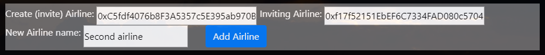

See in the console of the browser the message "Success inviting airline!"
Also, in the display are of the UI, you can see the transaction ID of this action.

Now, the 'Second airline" is added in the invited queue, but it's not registered yet.


### Fund an invited airline

1. In the "Fund Airline" field, enter the address of the previously invited airline
`0xC5fdf4076b8F3A5357c5E395ab970B5B54098Fef`
2. In the "Fund value" field, enter 10, which is the required airline funding fee
3. Click the "Fund airline" button


See in the console of the browser the message "Success funding airline!"
Also, in the display are of the UI, you can see the transaction ID of this action.

Now, the 'Second airline" is fully registered!
The registratoin happens automatically for an invited airline that has funded itself the required funding fee.
This automation happens for the first 4 airlines only

The next airlines, after being invited and funded, will require also voting from the registered airlines.
Will test the voting features later-on, below.


### Register a new flight

1. Enter the name or ID of the new flight to be registered ("ABC", or something else)
2. Enter the airline registering this flight. Since we just registered the Second airline, enter its address:
`0xC5fdf4076b8F3A5357c5E395ab970B5B54098Fef`
3. Enter the flight departure date and time in the specified format ("01-02-2020 14:35:00" or something else)
4. Click the "Register flight" button

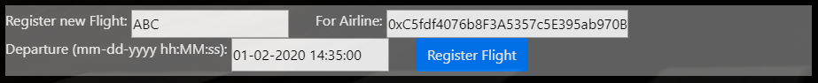

See in the console of the browser the message "Success registering flight!"
Also, in the display are of the UI, you can see the transaction ID of this action.


### Buy insurance for a registered flight

1. Enter the flight buying insurance for. Use the same flight name/ID as above - "ABC" or the value you entered previously.
2. Enter the airline that this flight was registered for. Use the same airline address at the flight registration time - as above:
`0xC5fdf4076b8F3A5357c5E395ab970B5B54098Fef` - or the airline you entered previously.
3. Enter the departure date-time of this flight. Use the same value at the flight registration time, as you entered previously - 
`01-02-2020 14:35:00` or the value you entered
4. Enter the address of the traveler buying this insurance. For travelers, I allocated the address range address(11) ... address(20), so for this test, I used address at index 11:
`0x69e1CB5cFcA8A311586e3406ed0301C06fb839a2`
5. Enter the insurance value (in ether) - more than 0 and smaller or equal to 1 - (entered "1")
6. Click the "Insure Flight" button

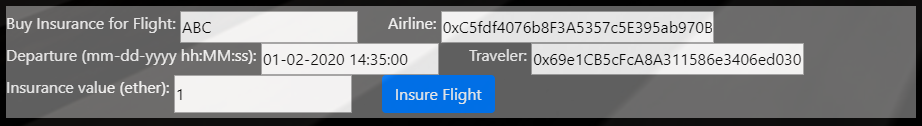

See in the console of the browser the message "Success buying insurance!"
Also, in the display are of the UI, you can see the transaction ID of this action.

Please note in Ganache, the account balance of the travele's address decreased with the same amount as the one payed for buying this flight insurance.


### Update the status of a flight

1. Enter the flight name/ID to update the flight status. Use the same value as you entered above ("ABC")
2. Enter the airline address this flight was registered to. Use the same value as above (`0xC5fdf4076b8F3A5357c5E395ab970B5B54098Fef`)
3. Enter the departure date-time. Enter teh same value as above ("01-02-2020 14:35:00")
4. Select a flight status from the drop-down list
5. click on the "Update Fligh Status" button
6. Try a couple of statuses. Make sure the last status update is for "LATE_AIRLINE", because we will need to test the insurance credit later-on

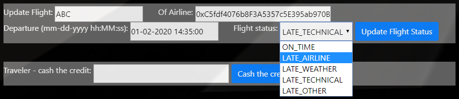

See in the console of the browser the message "Success updating the flight status!"
Also, in the display are of the UI, you can see the transaction ID of this action.


### Traveler cashing the credit

1. Enter the address of the traveler who purchased the insurance above
`0x69e1CB5cFcA8A311586e3406ed0301C06fb839a2`
2. Click on "Cash the credit of Traveler"


See in the console of the browser the message "Success cashing the credit of the traveler!"
Also, in the display are of the UI, you can see the transaction ID of this action.

Please note in Ganache, the account balance of this traveler increased with amount payed for insurance times the credit multiplier (set in the first Dapp test at 3).


### Fetch flight status from oracles

1. Enter the flight name/ID for which to fetch the flight status from oracles (previously set for "ABC")
2. Enter the airline this flight is registered (previously set for `0xC5fdf4076b8F3A5357c5E395ab970B5B54098Fef`)
3. Enter the departure date of this flight (previously set for "01-02-2020 14:35:00")
4. Click on the "Submit to Oracles" button
4. Watch the output of the terminal in which the server is running

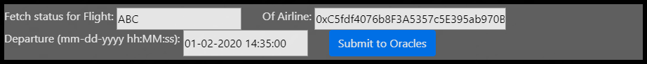

When testing this, the random index generated for oracles was 5.
This is the output of the server, confirming the event received and the oracle submission.

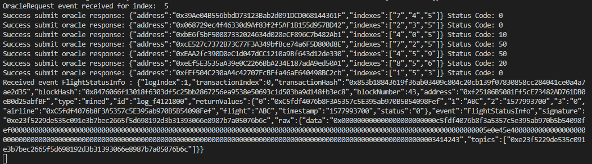


### Vote for invited airlines (multi party consensus)

1. Invite the "Third airline" and "Forth airline" based on the address index 3 and 4:
"Third airline"  - `0x821aEa9a577a9b44299B9c15c88cf3087F3b5544`
"Fourth airline" - `0x0d1d4e623D10F9FBA5Db95830F7d3839406C6AF2`
For the inviting airline, use the one of previously registered airlines (`0xf17f52151EbEF6C7334FAD080c5704D77216b732`)
2. Fund the "Third airline and the "Fourth airline with the required 10 ether
Now the Third airline and the Fourth airline are automatically registered on funding, theydon't need voting. An attempt to vote for the first 4 invited and funded airlines, with throw an error, as expected.
3. Invite the Fifth airline! Use the Ganache address at index 5 `0x2932b7A2355D6fecc4b5c0B6BD44cC31df247a2e`
4. Fund the Fifth airline with the required 10 ether.
Now the airline is funded but not registered automatically. It needs a minimum 50% YES votes from the already registered airlines.
5. Vote for the Fifth airline `0x2932b7A2355D6fecc4b5c0B6BD44cC31df247a2e` from the First airline `0xf17f52151EbEF6C7334FAD080c5704D77216b732`
Vote NO by clicking on the "Vote NO" button.
6. Vote for the Fifth airline `0x2932b7A2355D6fecc4b5c0B6BD44cC31df247a2e` from the Second airline `0xC5fdf4076b8F3A5357c5E395ab970B5B54098Fef`
Vote NO by clicking on the "Vote NO" button.
7. Vote for the Fifth airline `0x2932b7A2355D6fecc4b5c0B6BD44cC31df247a2e` from the Third airline `0x821aEa9a577a9b44299B9c15c88cf3087F3b5544`
Vote YES by clicking on the "Vote YES" button.
8. Vote for the Fifth airline `0x2932b7A2355D6fecc4b5c0B6BD44cC31df247a2e` from the Fourth airline `0x0d1d4e623D10F9FBA5Db95830F7d3839406C6AF2`
Vote YES by clicking on the "Vote YES" button.

9. Now, the Fifth airline has 50% of the YES votes, and it was automatically registered on the last vote that made the 50% threshold. We can test this by registering a new flight for the Fifth airline
- flight: `XYZ`
- airline: `0x2932b7A2355D6fecc4b5c0B6BD44cC31df247a2e`
- departure: `05-17-2021 19:28:00`
Click the "Register Flight" button.

See in the console of the browser the message "Success registering flight!"
Also, in the display are of the UI, you can see the transaction ID of this action.

This voting mechanism proves the implementation of the multi-party consensus!


## Packages and software used

- Truffle v5.0.9 (core: 5.0.9)
- Solidity - ^0.4.24 (solc-js)
- Node v10.15.1
- Web3.js v1.0.0-beta.37
- HDwallet provider 1.0.5
- Express 4.16.4

Development done on Windows 10, with Visual Studio Code

## Author

	D. Grebenisan

## Resources

* [How does Ethereum work anyway?](https://medium.com/@preethikasireddy/how-does-ethereum-work-anyway-22d1df506369)
* [BIP39 Mnemonic Generator](https://iancoleman.io/bip39/)
* [Truffle Framework](http://truffleframework.com/)
* [Ganache Local Blockchain](http://truffleframework.com/ganache/)
* [Remix Solidity IDE](https://remix.ethereum.org/)
* [Solidity Language Reference](http://solidity.readthedocs.io/en/v0.4.24/)
* [Ethereum Blockchain Explorer](https://etherscan.io/)
* [Web3Js Reference](https://github.com/ethereum/wiki/wiki/JavaScript-API)