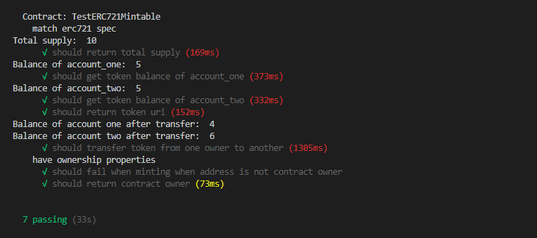
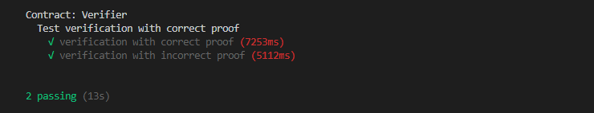
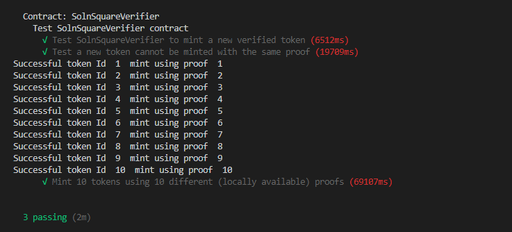
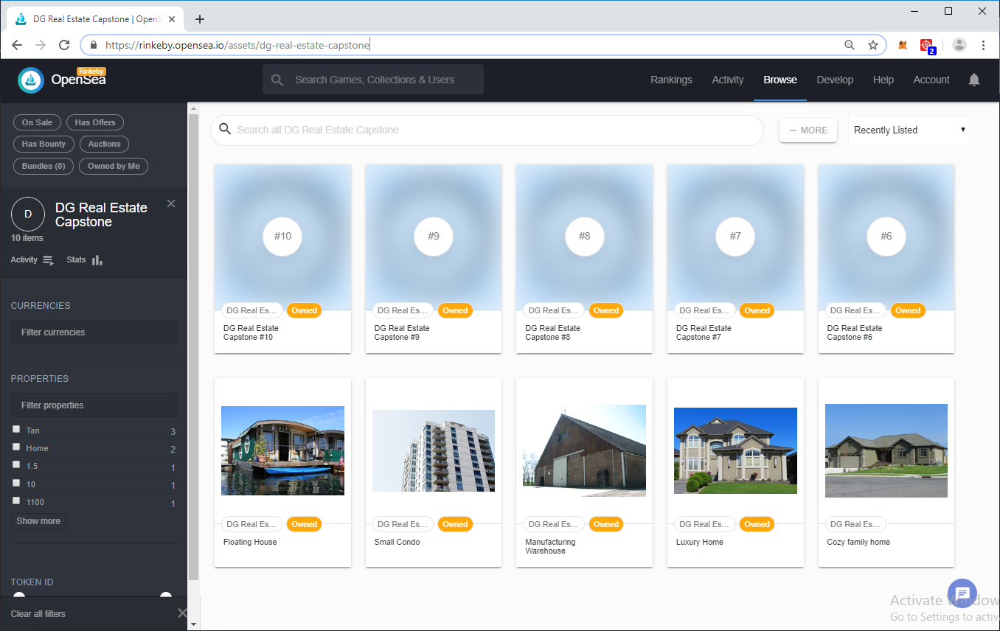
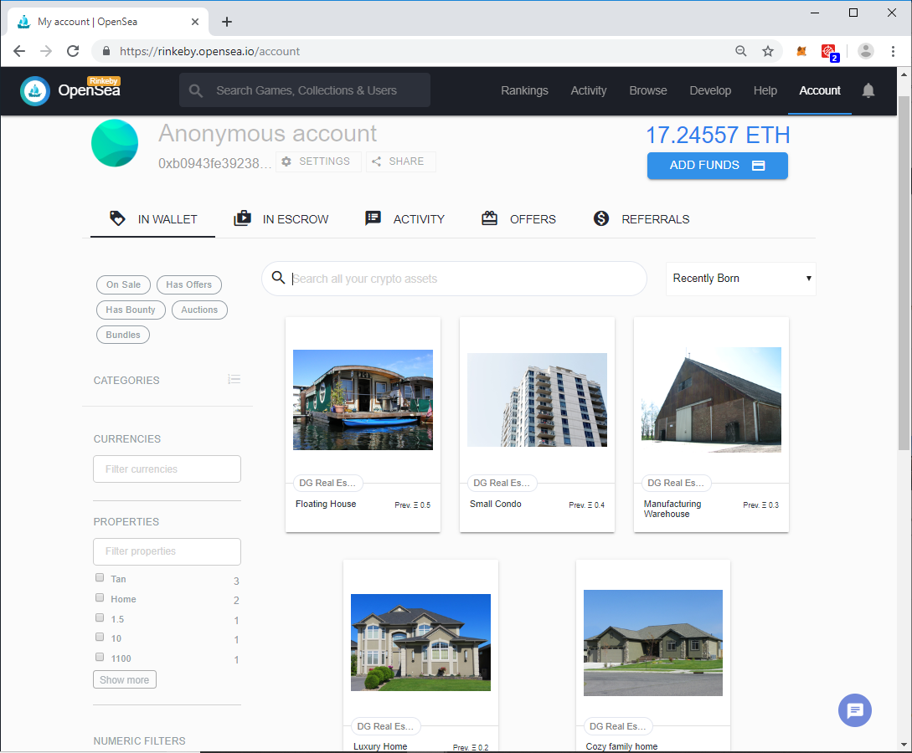
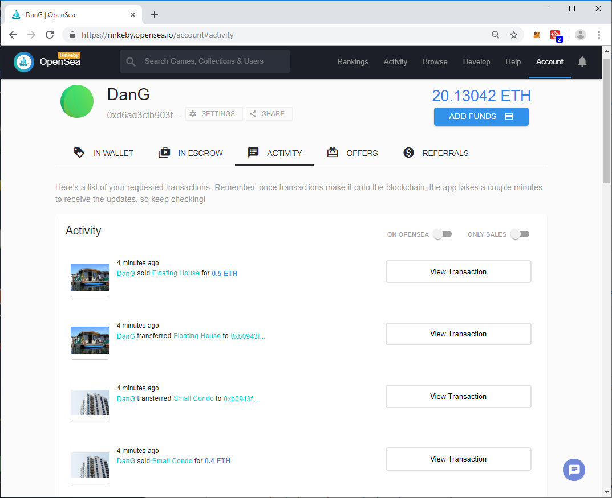
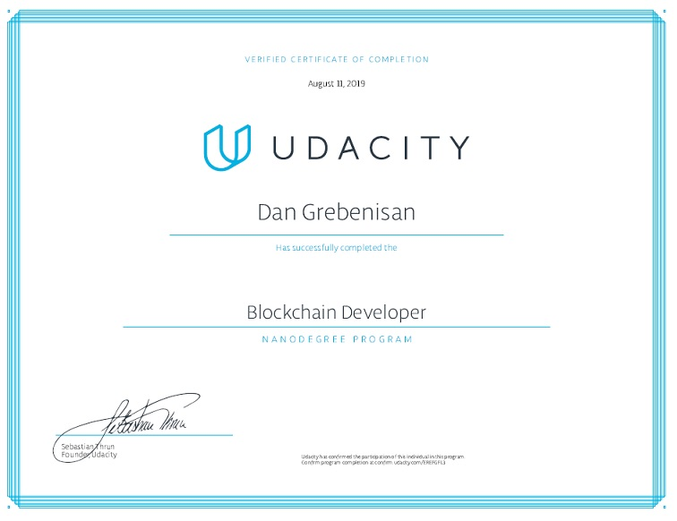

# Real Estate Marketplace - the Udacity Blockchain Developer capstone project


The Real Estate Marketplace project is the Udacity Capstone project for the Blockchain Developer nanodegree. It is a decentralized housing system, build on the Ethereum platform. It features Solidity smart contracts compliant with the ERC721 standard for creating un-fungible tokens - in this case, the real estate houses, condos and units for sale. This project also features the zero knowledge proofing technology, or zk-SNARKs, build with the ZoKrates framework, enabling a much higher security of the token ownership. The zkSNARKs is the perfect technology to enable secure title transfer and ownership in the Real Estate business.

At present, property titles are often paper-based, creating opportunities for errors and fraud. Title professionals find defects in 25% of all titles during the transaction process, according to the American Land Title Association.

Any identified defect makes it illegal to transfer a property title to a buyer until it is rectified. This means property owners often incur high legal fees to ensure authenticity and accuracy of their property titles.

Moreover, title fraud poses a risk to homeowners worldwide. US losses associated with title fraud reportedly averaged around $103,000 per case in 2015, compelling many property buyers to purchase title insurance.

These title management issues could potentially be mitigated by using blockchain technology to build immutable digital records of land titles and using blockchain for transparent transactions. This approach could simplify property title management, making it more transparent and helping to reduce the risk of title fraud and the need for additional insurance.

Some companies and governments around the globe have already implemented blockchain technology for the title management process.

Ghanaian blockchain company Bitland has been working on a solution for Ghana, where it is estimated that almost 80% of land is unregistered, according to Forbes. Those that possess unregistered land find it more difficult to prove legal ownership, increasing their exposure to the risk of land seizures or property theft.

Bitland is seeking to create secure digital public records of ownership on its blockchain platform, with the aim of protecting land owners from title fraud. Bitland has expanded to operate in 7 African nations, India, and is also working with Native Americans in the US.

The demo of this project mints 10 ERC721 unfungible tokens, lists a number of them for sale on the OpenSea platform, and they are purchased from another account, for the full lifecycle of the tokens.

## Software and packages required

- Node v10.15.1
- Truffle v5.0.9
- Ganache 1.3.0
- Solidity v0.5.0
- Web3.js v1.0.0-beta.37
- ZoKrates 0.3.0
- Docker 2.1.0.0
- truffle-hdwallet-provider 1.0.5
- OpenZeppelin Solidity 2.2.0
- JavaScript ECMAScript 6
- MetaMask 6.7.3
- Visual Studio Code 1.36

## Install

To install, download or clone this repo, change in the root directory of the application and run:

```
    cd RealEstateMarketplace
    npm install
```

## Create the Zokrates verifier and proofs

1. Launch a docker session with the Zokrates platform:
`docker run -v D:/Blockchain/RealEstateMarketplace/zokrates/code:/home/zokrates/code -ti zokrates/zokrates:0.3.0 /bin/bash`
2. Change directory to `cd code/square`
3. Compile the Zokrates code:
`~/zokrates compile -i square.code`
4. Run the setup, compute the witness, generate the proofs and export the verifier smart contract:
```
    ~/zokrates setup
    ~/zokrates compute-witness -a 3 9
    ~/zokrates generate-proof
    ~/zokrates export-verifier
```
Run the proof generation step multiple times to generate multiple proofs, and save each one with a different name.
This is required when minting multiple tokens, each one gets verified by a unique proof.

## Compile and migrate

Change directory to `eth-contracts` and  run:

```
    truffle compile
    truffle migrate --reset
```

## Testing

Start Ganache with at least a couple of accounts, on port 7545.
From the `eth-contracts` directory, execute the following:

### Test the ERC721Mintable smart contract:

`truffle test test/TestERC721Mintable.js`




### Test the Verifier smart contract:

`truffle test test/TestSquareVerifier.js`




### Test the SolnSquareVerifier smart contract:

`truffle test test/TestSolnSquareVerifier.js`




## Migrate to Rinkeby testnet

In the `truffle-config.js` file, enter your Metamask mnemonic for Rinkeby, and your Infura key for this project, and save

From the `eth-contracts` directory, execute:

```
    truffle migrate --network rinkeby
```

The owner and contract addresses of my deployment are:

- Token name and code:          `DG Real Estate Capstone`, `DGRE`
- Owner account:                `0xd6aD3CFb903f109291EAb07c3d97Da8d55f16dbe`
- Contract Verifier address:    `0x0ce97bC8b1C1885bfE1f0f4cCF69e0542EC3c87D`
- Contract SolnSquareVerifier:  `0xC33760a78bb2aD7737EF6dceaE0E186f9d9c56aC`
- Etherscan: [https://rinkeby.etherscan.io/address/0xc33760a78bb2ad7737ef6dceae0e186f9d9c56ac](https://rinkeby.etherscan.io/address/0xc33760a78bb2ad7737ef6dceae0e186f9d9c56ac)


## Mint the 10 tokens

1. Change to the `scripts` directory.
2. In the `mint.js` file, update your mnemonic as in your Metamask, and your Infura key for this project, and save.

3. Then run:
```node mint.js```

The script mints 10 unique, un-fungible ERC721 tokens, using the address[0] as owner `0xd6aD3CFb903f109291EAb07c3d97Da8d55f16dbe`
The minting of the tokens are individually verified with the zk-SNARK proofs located in the `zokrates/code/square` directory.

4. The output of the script confirms the successful mint of the tokens and the corresponding transaction:
```
Success minting token 1 , Tx: 0x6d1bbc5ceea3349498ad1800e5cf425ed6173d6210fad06b7a199534f167f3e7
Success minting token 2 , Tx: 0xf594ca5a0e152bde9df3ac874a2e6c86ec37edd9f9e85761e7a4bcbc0a7f7930
Success minting token 3 , Tx: 0xea52a4fb803fa4fa3e9f03c8363c8efd935490bbd5503df05d0f20e6992e059c
Success minting token 4 , Tx: 0xcc69c41ba836f6736391277aa1baf523caf2e1255601e17e6532e0210a3cc318
Success minting token 5 , Tx: 0xbf32f2ab007d45ffdf0122e50a0c52d1298693d153a3c49fbe11434db411eafa
Success minting token 6 , Tx: 0xdca2e1ac5f22be8df8cfb7a0ded113c1f495e7fb815ef9d1fec63b42b779bcbb
Success minting token 7 , Tx: 0x620a271837d872963b1e1b664d3960ba2d31203529c5ff47f7caa8b853ad6829
Success minting token 8 , Tx: 0xc0ef979b5e9ef4b008cc08e62f0fbb07e2e5575d0b7c00bfb841f18dc9aa7133
Success minting token 9 , Tx: 0xad0b175d9742dd308f36717c80397be4a33e1045731689b98031edcd9a5ce6eb
Success minting token 10 , Tx: 0x2292d59dffbdf1f586f34f55e5c53590dc982c3fff477a5a7807ab0d51bab4c2
```

## Add tokens to OpenSea, sell them and buy them from another account:

1. Set my Metamask account: `0xd6ad3cfb903f109291eab07c3d97da8d55f16dbe`
2. In OpenSea, enter the address of the SolnSquareVerifier smart contract, and load all the minted tokens.
3. The OpenSea marketplace page for this contract is:
    [https://rinkeby.opensea.io/assets/dg-real-estate-capstone](https://rinkeby.opensea.io/assets/dg-real-estate-capstone)



4. List `For sale` the first 5 tokens from seller address `DanG: 0xd6ad3cfb903f109291eab07c3d97da8d55f16dbe`
```
https://rinkeby.opensea.io/assets/0xc33760a78bb2ad7737ef6dceae0e186f9d9c56ac/1
https://rinkeby.opensea.io/assets/0xc33760a78bb2ad7737ef6dceae0e186f9d9c56ac/2
https://rinkeby.opensea.io/assets/0xc33760a78bb2ad7737ef6dceae0e186f9d9c56ac/3
https://rinkeby.opensea.io/assets/0xc33760a78bb2ad7737ef6dceae0e186f9d9c56ac/4
https://rinkeby.opensea.io/assets/0xc33760a78bb2ad7737ef6dceae0e186f9d9c56ac/5
```
5. Purchase all the tokens from this address:
`Buyer: 0xb0943fe392385cc3b198e5166e572b76aa35787b`

Now, this buyer address is the owner of the 5 purchased tokens:


6. Check the activity of the seller address `DanG: 0xd6ad3cfb903f109291eab07c3d97da8d55f16dbe`




## Development

This project was coded and tested with Visual Studio Code 1.36.1, on Windows 10

# Project Resources

* [Remix - Solidity IDE](https://remix.ethereum.org/)
* [Visual Studio Code](https://code.visualstudio.com/)
* [Truffle Framework](https://truffleframework.com/)
* [Ganache - One Click Blockchain](https://truffleframework.com/ganache)
* [Open Zeppelin ](https://openzeppelin.org/)
* [Interactive zero knowledge 3-colorability demonstration](http://web.mit.edu/~ezyang/Public/graph/svg.html)
* [Docker](https://docs.docker.com/install/)

* [Zero-knowledge Proof](https://en.wikipedia.org/wiki/Zero-knowledge_proof)
* [Understand Zero Knowledge Proofing](https://hackernoon.com/eli5-zero-knowledge-proof-78a276db9eff)
* [Understanding Zero Knowledge Proofing](https://blog.goodaudience.com/understanding-zero-knowledge-proofs-through-simple-examples-df673f796d99)

* [ZoKrates](https://github.com/Zokrates/ZoKrates)
* [ZoKrates docs](https://zokrates.github.io/)
* [ZoKrates tutorial](https://zokrates.github.io/sha256example.html)

* [OpenSea](https://docs.opensea.io/docs)

* [Vitalik Buterin paper on zkSNARKs](https://ethresear.ch/t/on-chain-scaling-to-potentially-500-tx-sec-through-mass-tx-validation/3477)


# Blockchain Developer nanodegree


