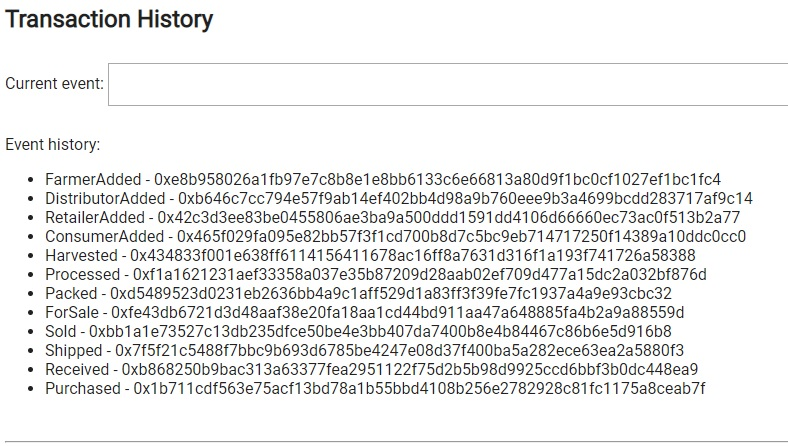

# Dan's Fair Trade Coffee - a Blockchain based Supply Chain Management System

This repository containts an Ethereum DApp that demonstrates a coffee Supply Chain flow. The user story is similar to any commonly used supply chain process. 
A Farmer can harvest items to the inventory system stored in the blockchain. After harversting, the Farmer will process the item, pack it and put it for sale.
A Distributor can buy the item from the farmer and ship it to a Retailer. Then, a Cosumer can purchase the item from the Retailer.

## Software and packages used:

- Truffle v4.1.15 (core: 4.1.15)
- Ganache CLI v6.4.1 (ganache-core: 2.5.3)
- Solidity v0.4.25 (solc-js)
- Truffle hdwallet provider 1.0.5
- Lite-server 2.4.0

Development done on Windows 10, with Visual Studio Code

## Installing and building:

- Clone this repository:
```
git clone https://github.com/grebenisan/blockchain/tree/master/SupplyChain
```
- Change directory to `project-6` folder and install all requisite npm packages (as listed in `package.json`):
```
cd project-6
npm install
```
- Compile the smart contracts:
```
truffle compile --all
```


- This will create the smart contract artifacts in folder ```build\contracts```.

## Running local with Ganache
- Launch Ganache with the same mnemonic sugestd by the skeleton code:
```
ganache-cli -m "spirit supply whale amount human item harsh scare congress discover talent hamster"
```


- Migrate smart contracts to the locally running (ganache-cli) blockchain:
```
truffle migrate --reset
```


- The address of the SupplyChain contract on local is `0x23e2b13b08a22e9eee431f862ec7a17ab1e99b98` 
and the deployment transaction is `0xf4cc98c8f6d94cda0b0a27452d766aa20a6758fcfe007e89f216c9615bf5dc43`

- Test smart contracts:
```
truffle test
```
All 18 tests should pass as in this image:


- In a separate terminal window, launch the DApp:
```
npm run dev
```
The DApp will start in the browser and the Metamask will prompt if you accept the DApp to connect to.

- Make sure the Metamask is set on the first address generated by ganache-cli `0x27d8d15cbc94527cadf5ec14b69519ae23288b95`. 
This address is the owner of the smart contracts.

- Add the Farmer role to the second adress generated by ganache-cli `0x018c2dabef4904ecbd7118350a0c54dbeae3549a`
Put this address in the `Assign Roles to Addresses` top section of the DApp, and click the `add Farmer` button:


- Add the Distributor role to the third adress generated by ganache-cli `0xce5144391b4ab80668965f2cc4f2cc102380ef0a`
Put this address in the `Assign Roles to Addresses` top section of the DApp, and click the `add Distributor` button:


- Add the Retailer role to the fourth adress generated by ganache-cli `0x460c31107dd048e34971e57da2f99f659add4f02`
Put this address in the `Assign Roles to Addresses` top section of the DApp, and click the `add Retailer` button:


- Add the Consumer role to the fifth adress generated by ganache-cli `0xd37b7b8c62be2fdde8daa9816483aebdbd356088`
Put this address in the `Assign Roles to Addresses` top section of the DApp, and click the `add Consumer` button:


- Switch the current address in Metamask, to the address that was assigned the Farmer role `0x018c2dabef4904ecbd7118350a0c54dbeae3549a`
- In the DApp execute the Farmer steps: Harvest, Process, Pack and ForSale

- Switch the current address in Metamask, to the address that was assigned the Distributor role `0xce5144391b4ab80668965f2cc4f2cc102380ef0a`
- In the DApp execute the Distributor steps: Buy, Ship

- Switch the current address in Metamask, to the address that was assigned the Retailer role `0x460c31107dd048e34971e57da2f99f659add4f02`
- In the DApp execute the Retailer step: Receive

- Switch the current address in Metamask, to the address that was assigned the Cosnumer role `0xd37b7b8c62be2fdde8daa9816483aebdbd356088`
- In the DApp execute the Consumer step: Purchase

- Verfy the events emited by each of these steps:
Event history for local (ganache-cli) run :



## Deploying the smart contracts on Rinkeby testnet:

- In the truffle.js file, replace the value of `infuraProjectId` with your Infura key, and the value of `mnemonic` with your Metamask mnemonic.

- Migrate smart contracts to the Rinkeby testnet:
```
truffle.cmd migrate --reset --network rinkeby
```


- The address of the SupplyChain contract on Rinkeby is `0x7261fdb838621dd353c807b8a0c6fccbfc5b334f` 
and the deployment transaction is `0x3f63819ffb695fa0c0cc2cdec2bb752204b4a4329928485e2f2552a602cb9ba1`

Rinkeby smart contract addresses:

| Contract Name   |  Contract Address                            |
|-----------------|----------------------------------------------|
| SupplyChain     |  0x7261fdb838621dd353c807b8a0c6fccbfc5b334f  |
| FarmerRole      |  0x941a6e56201eccb4918220c50b9edab467636a50  |
| DistributorRole |  0xcf1fb81fe238f8576453db7ccd1b8ba6edded2e8  |
| RetailerRole    |  0xc5501a9cf124aae043c8dbe2631a6a8d1592c3c7  |
| ConsumerRole    |  0x26634cccc4229f14f86aaeb4405c6002191110db  |


## Running on Rinkeby

- the address owner used to deploy the contracts on Rinkeby was `0xd6aD3CFb903f109291EAb07c3d97Da8d55f16dbe`
- Launch the DApp:
```
npm run dev
```

- Add the Farmer role for the adress `0xb0943FE392385cC3b198e5166e572b76aA35787b`
Put this address in the `Assign Roles to Addresses` top section of the DApp, and click the `add Farmer` button:


- Add the Distributor role for the adress `0xc3345fD3038BF1Fe86385d2b02DFc7c9dE787036`
Put this address in the `Assign Roles to Addresses` top section of the DApp, and click the `add Distributor` button:


- Add the Retailer role for the adress `0x777D5892AE335A69a39C4ECe8F84fb7D4074d9A5`
Put this address in the `Assign Roles to Addresses` top section of the DApp, and click the `add Retailer` button:


- Add the Consumer role for the adress `0x271616521cDe191Ac6f8563B4E0CC600AD2DcEcb`
Put this address in the `Assign Roles to Addresses` top section of the DApp, and click the `add Consumer` button:


- In the DApp execute the Farmer steps: Harvest, Process, Pack and ForSale
- In the DApp execute the Distributor steps: Buy, Ship
- In the DApp execute the Retailer step: Receive
- In the DApp execute the Consumer step: Purchase
- Verfy the transactions and events emited by each of these steps:

Event history on Rinkeby for SupplyChain contract `0x7261fdb838621dd353c807b8a0c6fccbfc5b334f`:

| Event             | Transaction                                                        |
|-------------------|--------------------------------------------------------------------|
| FarmerAdded       | 0x235d7b81b64963d12b083504a08d4561e763693f74365a4e08e5eb44dd76d3e4 |
| DistributorAdded  | 0xcf4e8d6c7d7ec537456e9aaa37bcfbb7e7a410c40aa20b7157b571982b57a729 |
| RetailerAdded     | 0x66b1cadd2083c7d1778a8e0aed3e5f3690eed76cecae69cb1694f55dd538025b |
| ConsumerAdded     | 0x1f71a11839cd832312e84a203260124d913ee57c68ee71575bf8d29acee860b6 |
| Harvested         | 0xf40428c906b2309c25b1a670a15e389648e87ac93e1712ad9c44d07b4d2bc8c2 |
| Processed         | 0xd8402d5273ae276bd0c00c66de21126d6a1bc0e2efca272a6f0d4465bf61a46f |
| Packed            | 0xe60cb24cbc36a2d09e0b10522c3b51ec19c8f5a91463e061742e1fb86597a386 |
| ForSale           | 0xeb45bdaba7998ece32dff0991de2258baefaa6712fcc80604ad026e73b56856d |
| Sold              | 0x100acbf7544566e9409377ff8a778400b9a8fb8875df9c3e991489d28926ec27 |
| Shipped           | 0x6b3f18549190eb901bc0e2d6281a8b5693b5c111358893e54ae76783369fca6f |
| Received          | 0xce8615c6b1e736620c451c07b83f858387599357a878744b2b9f91bf8f295600 |
| Purchased         | 0xdd8333fd6fddf4141f4b5189d82796562f893064fd6b6b72bc2c61fa1271e7c4 |


## Architecture diagrams:

### Sequence


### Activity


### State


### Class


## Built With

* [Ethereum](https://www.ethereum.org/) - Ethereum is a decentralized platform that runs smart contracts
* [Truffle Framework](http://truffleframework.com/) - Truffle is the most popular development framework for Ethereum with a mission to make your life a whole lot easier.


## Author

	D. Grebenisan

## Acknowledgments

* Solidity
* Ganache-cli
* Truffle

